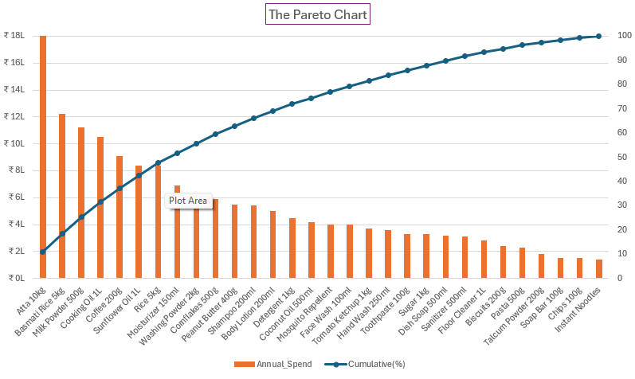

# Inventory-Optimization-Analysis
### EOQ Modelling | Safety Stock | ABC Classification

## Business Problem
An FMCG distributor was experiencing stockouts on key products while simultaneously tying up capital in slow-moving inventory. The ordering policy had no scientific basis - reorder quantities and reorder points were set arbitrarily.

## Objective
Analyse inventory data across 30 SKUs to identify ordering inefficiencies, calculate optimal order quantities, and recommend a tiered inventory control framework.

## Tools Used
- Microsoft Excel (EOQ Modelling, IF formulas, Pareto Chart)

## Dataset
- 30 SKUs across 5 categories: Grocery, Personal Care, Household, Food
- Variables: Annual Demand, Unit Cost, Ordering Cost, Holding Cost %, Lead Time, Demand Std Deviation

## Methodology
### 1. EOQ (Economic Order Quantity)
Calculated optimal order quantity minimising total inventory cost:
EOQ = SQRT((2 × Annual Demand × Ordering Cost) ÷ (Unit Cost × Holding Cost %))

### 2. Safety Stock
Calculated buffer stock at 95% service level:
Safety Stock = 1.65 × Std Dev × SQRT(Lead Time)

### 3. Reorder Point (ROP)
ROP = (Avg Daily Demand × Lead Time) + Safety Stock

### 4. ABC Classification
Ranked all 30 SKUs by Annual Spend (Demand × Unit Cost) and classified into A / B / C tiers using the 70-20-10 rule.

## Key Findings
- 25 of 30 SKUs were under-ordered vs EOQ optimal quantities
- Current ordering policy costs ₹1.19 lakh more per year than an EOQ-optimised approach
- Reorder points were 10–19x below calculated optimal levels for high-value items — flagging critical stockout risk
- 13 A-category SKUs drive 69% of total inventory value (₹1.63 crore)

## Recommendations
1. Immediately adopt calculated ROP values for all A-category SKUs to eliminate stockout risk
2. Switch to EOQ-based ordering quantities across all 30 SKUs
3. Implement tiered review frequency:
   - A items: Weekly stock review
   - B items: Fortnightly review
   - C items: Monthly bulk ordering

## Pareto Chart — ABC Classification

